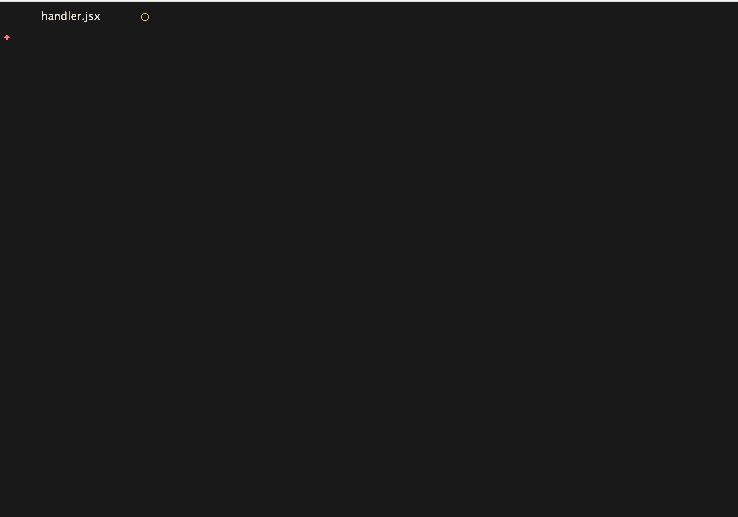

# react-v0.14-snippets

This is a fork of [sublime-react-es6-snippets](https://github.com/mboperator/sublime-react-es6)

- Classes with the new ES6 shorthand.

- Static class variables (defaultProps, propTypes) are declared using ES7 property intializers.

- ES6 style exports and imports for component creating snippets.

- Added `rrc` for Redux connected components.

 The main changes I've made include:

- Include more snippets:

- Stateless components

- Proptypes

- No semicolons



## Installation

Open Package Control inside of Sublime Text using shift + cmd + P

Search for: Package Control: Add Repository

Add the link to your repo: https://github.com/username/repo-name

Now install the snippets: shift + cmd + P To launch Package Control again.

Start typing: Package Control: Install Package

Search for the repo name.

Start using your new snippet collection!

#### Documentation of available snippets (JSX):

```
    cdm→  componentDidMount: fn() { ... }

   cdup→  componentDidUpdate: fn(pp, ps) { ... }

     cs→  import cx from 'classnames'

    cwm→  componentWillMount: fn() { ... }

    cwr→  componentWillReceiveProps: fn(np) { ... }

    cwu→  componentWillUpdate: fn(np, ns) { ... }

   cwun→  componentWillUnmount: fn() { ... }

     cx→  cx({ ... })

    fdn→  React.findDOMNode(...)

    fup→  forceUpdate(...)

    gdp→  static defaultProps = { ... } 

    gis→  getInitialState: fn() { return {...} } 

    ism→  isMounted()

  props→  this.props.

     pt→  propTypes { ... }

     pt→  propTypes { ... }

    pta→  PropTypes.arrayOf

   ptai→  PropTypes.arrayOf (Instances)

    ptb→  PropTypes.bool

    pte→  PropTypes.element

    ptf→  PropTypes.func

    pti→  PropTypes.instanceOf

    ptn→  PropTypes.number

    ptn→  PropTypes.node

    pto→  PropTypes.object

   ptof→  PropTypes.objectOf

   ptof→  PropTypes.oneOf (Enum)

  ptoft→  PropTypes.oneOfType (Union)

    pts→  PropTypes.string

   ptsp→  PropTypes.shape

    rcc→  component skeleton

   rcsc→  stateless class

   refs→  this.refs.

    ren→  render: fn() { return ... }

    rrc→  redux component skeleton

    scu→  shouldComponentUpdate: fn(np, ns) { ... }

    sst→  this.setState({ ... })

  state→  this.state.

```

## Contributing

### Rebuilding the docs

After making changes to snippet files, run `npm install && npm run build-docs` to automatically generate this document from source. **Do not** make changes to README.md directly.

